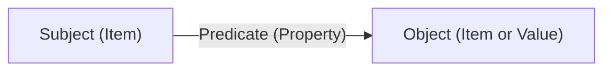

A **knowledge graph** powers every world. Worlds organizes information in a graph-based structure rather than rigid tables, allowing you to model complex relationships with precision and update individual facts without rebuilding your entire dataset.

## Knowledge primitives

To build with Worlds, you need to understand the three fundamental building blocks of knowledge.

<CardGroup cols={3}>
  <Card title="Items" icon="circle-dot">
    The distinct "things" in your world — a person, a piece of code, a company. Every item is identified by a unique IRI.
  </Card>
  <Card title="Properties" icon="arrow-right">
    The "verbs" or "connectors" that define how items relate. Examples: `worksOn`, `managerOf`, `hasPriority`.
  </Card>
  <Card title="Facts" icon="check">
    A fact connects two items using a property, forming a triple: `subject → predicate → object`.
  </Card>
</CardGroup>

## The RDF triple model

Every fact in a world is stored as an RDF triple:



| Component | Example |
| :--- | :--- |
| **Subject** | `<http://example.com/ethan>` |
| **Predicate** | `<http://schema.org/worksOn>` |
| **Object** | `<http://example.com/project-worlds>` |

## Why graphs over tables

Knowledge graph statements represent facts, not rows in a schema. Unlike a relational database where adding a new relationship type requires a schema migration, you can add any triple to a world at any time.

| Capability | Relational DB | Worlds knowledge graph |
| :--- | :--- | :--- |
| **Flexibility** | Fixed schema, requires migrations | Schema-free, any triple at any time |
| **Updates** | Row-level updates | Surgical triple-level mutations |
| **Traversal** | JOINs across tables | Graph traversal via SPARQL |
| **Audit trail** | Custom implementation | Built-in per-world logs |
| **Search** | Full-text or vector, separate system | Hybrid semantic + symbolic, built-in |

## Working with items

### Creating items

Create an item by inserting a triple with `rdf:type`:

```typescript
import { WorldsSdk } from "@wazoo/worlds-sdk";

const sdk = new WorldsSdk({
  baseUrl: "http://localhost:8000",
  apiKey: "your-api-key",
});

await sdk.worlds.sparql(worldId, `
  PREFIX rdf:    <http://www.w3.org/1999/02/22-rdf-syntax-ns#>
  PREFIX schema: <http://schema.org/>

  INSERT DATA {
    <http://example.com/ethan> rdf:type schema:Person ;
                               schema:givenName "Ethan" ;
                               schema:jobTitle "Engineer" .
  }
`);
```

### Adding properties

Connect items with named relationships:

```typescript
await sdk.worlds.sparql(worldId, `
  PREFIX schema: <http://schema.org/>

  INSERT DATA {
    <http://example.com/ethan> schema:worksOn <http://example.com/project-worlds> .
    <http://example.com/project-worlds> schema:name "Worlds Platform" .
  }
`);
```

### Querying relationships

Traverse the graph with SPARQL to answer relational questions:

```typescript
const result = await sdk.worlds.sparql(worldId, `
  PREFIX schema: <http://schema.org/>

  SELECT ?projectName WHERE {
    <http://example.com/ethan> schema:worksOn ?project .
    ?project schema:name ?projectName .
  }
`);

console.log(result.results.bindings[0].projectName.value);
// "Worlds Platform"
```

## Ontologies and schemas

An **ontology** defines the vocabulary your graph uses: what types of items exist, what properties they can have, and the relationships between those types. Importing an ontology before inserting instance data ensures your agents use a consistent language.

```typescript
// Import a schema using Turtle format
const ontologyTurtle = `
  @prefix rdfs:   <http://www.w3.org/2000/01/rdf-schema#> .
  @prefix schema: <http://schema.org/> .

  schema:Person a rdfs:Class ;
    rdfs:label "Person" .

  schema:worksOn a rdf:Property ;
    rdfs:domain schema:Person ;
    rdfs:label "worksOn" .
`;

await sdk.worlds.import(worldId, ontologyTurtle, { format: "turtle" });
```

## Why this matters for AI agents

Unlike statistical LLM weights, Worlds retrieves specific, auditable relationships:

- **Malleability**: Mutate and fork graphs in real time. Delete one triple to retract a fact without touching anything else.
- **Traceability**: Every claim has a symbolic path back to its source triple.
- **Evolution**: New facts surgically update or override old ones to maintain grounded truth across agent sessions.

<Tip>
Start with `schema.org` predicates like `schema:name`, `schema:description`, `schema:knows`, and `schema:worksOn`. They are widely recognized and give your agent a strong semantic foundation without defining a custom ontology.
</Tip>
