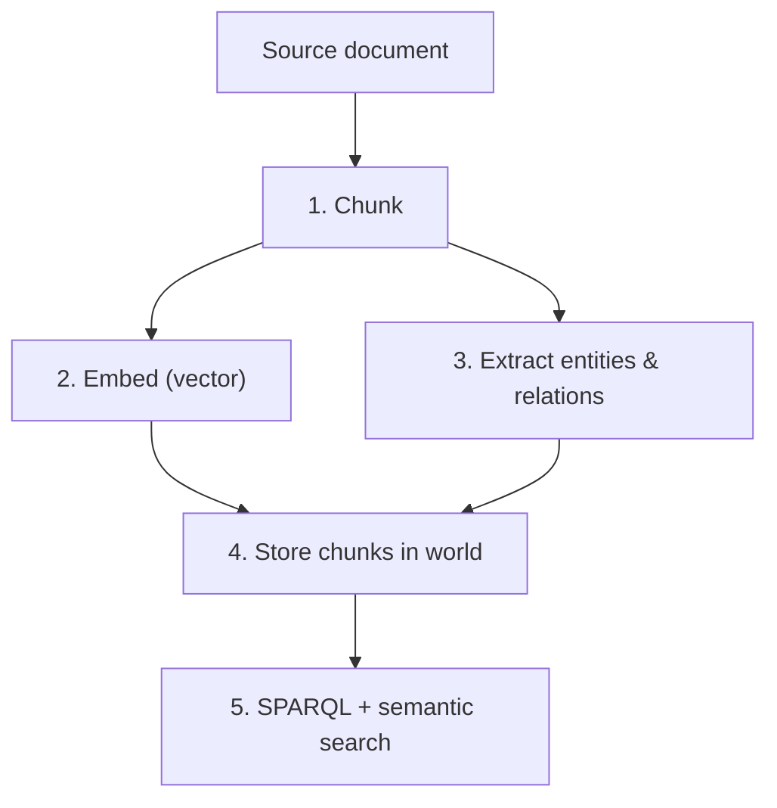

Document RAG transforms unstructured text into structured, queryable knowledge. Unlike traditional vector-only RAG, Worlds maintains the relationships between document fragments, enabling cross-document reasoning and verifiable fact retrieval.

## How it works



Each document segment is stored as a chunk linked to specific RDF triples. Retrieval can follow either the semantic (vector) path or the symbolic (SPARQL) path — or both.

## The ingestion pipeline

<Steps>
  <Step title="Chunk the document">
    Split your document into semantic segments. The platform's internal patch handler uses `RecursiveCharacterTextSplitter` with a default chunk size of 1000 characters and 200-character overlap.

    For custom chunking before import, split your text and join segments with meaningful delimiters before inserting as triple objects.
  </Step>
  <Step title="Extract entities and relationships">
    Use an LLM to identify entities and relationships within each chunk, mapping them to RDF triples:

    ```typescript
    // Prompt your LLM to extract structured facts
    const extractionPrompt = `
    Extract all entities and relationships from the following text.
    Return as RDF triples in Turtle format using schema.org predicates.
    Text: ${chunk}
    `;
    // Parse LLM response into Turtle
    ```
  </Step>
  <Step title="Import extracted triples">
    Import the extracted Turtle directly into the world:

    ```typescript
    import { WorldsSdk } from "@wazoo/worlds-sdk";

    const sdk = new WorldsSdk({
      baseUrl: "http://localhost:8000",
      apiKey: "your-api-key",
    });

    const turtleData = `
      @prefix schema: <http://schema.org/> .
      @prefix ex: <http://example.com/docs/> .

      ex:report-2024 a schema:Report ;
        schema:name "Q4 2024 Report" ;
        schema:author ex:alice ;
        schema:description "Revenue increased 23% YoY driven by enterprise segment growth." .

      ex:alice a schema:Person ;
        schema:name "Alice" ;
        schema:affiliation ex:acme-corp .
    `;

    await sdk.worlds.import(worldId, turtleData, { format: "turtle" });
    ```
  </Step>
  <Step title="Verify ingestion via SPARQL">
    Confirm the triples were written correctly:

    ```typescript
    const result = await sdk.worlds.sparql(worldId, `
      PREFIX schema: <http://schema.org/>
      PREFIX ex: <http://example.com/docs/>

      SELECT ?subject ?predicate ?object WHERE {
        ex:report-2024 ?predicate ?object .
        BIND(ex:report-2024 AS ?subject)
      }
    `);

    console.log(result.results.bindings);
    ```
  </Step>
</Steps>

## Retrieving context for generation

Combine SPARQL and semantic search to assemble document context:

```typescript
// Structured: find documents authored by a specific person
const authored = await sdk.worlds.sparql(worldId, `
  PREFIX schema: <http://schema.org/>
  PREFIX ex: <http://example.com/docs/>

  SELECT ?doc ?name WHERE {
    ?doc a schema:Report ;
         schema:author ex:alice ;
         schema:name ?name .
  }
`);

// Semantic: find relevant content by meaning
const related = await sdk.worlds.search(
  worldId,
  "enterprise revenue growth",
  {
    limit: 10,
    types: ["http://schema.org/Report"],
  },
);
```

## Benefits over vector-only document RAG

<CardGroup cols={3}>
  <Card title="Contextual continuity" icon="link">
    Follow relationships between different parts of a document or across multiple documents using SPARQL traversal.
  </Card>
  <Card title="Improved recall" icon="magnifying-glass">
    Retrieve specific document segments based on their logical role (author, date, topic) rather than just semantic proximity.
  </Card>
  <Card title="Verification" icon="shield-check">
    Cross-reference extracted facts against original triples to ensure accuracy and flag contradictions.
  </Card>
</CardGroup>

<Warning>
The quality of extracted triples depends on your LLM extraction prompt. Always validate a sample of extracted triples with SPARQL `ASK` queries before relying on them for agent context.
</Warning>
