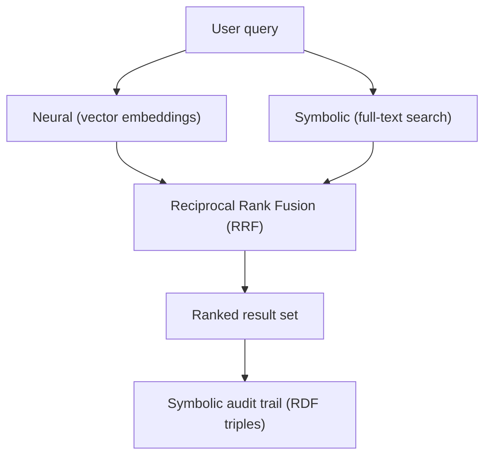

Worlds combines full-text search with vector-based retrieval to provide a neuro-symbolic discovery experience. Results are ranked using Reciprocal Rank Fusion (RRF) and each result is a verifiable RDF triple with symbolic audit trail.



## Basic search

Search a world using a natural language query:

```typescript
import { WorldsSdk } from "@wazoo/worlds-sdk";

const sdk = new WorldsSdk({
  baseUrl: "http://localhost:8000",
  apiKey: "your-api-key",
});

const results = await sdk.worlds.search(worldId, "people related to Ethan", {
  limit: 10,
});

for (const r of results) {
  console.log(r.subject, r.predicate, r.object);
  console.log("Score:", r.score, "| Vec rank:", r.vecRank, "| FTS rank:", r.ftsRank);
}
```

## Search result structure

Each result is a `TripleSearchResult`:

```typescript
interface TripleSearchResult {
  subject: string;       // Subject IRI
  predicate: string;     // Predicate IRI
  object: string;        // Object value (literal or IRI)
  vecRank: number | null; // Rank from vector search (null if no match)
  ftsRank: number | null; // Rank from full-text search (null if no match)
  score: number;         // Combined RRF score (higher = more relevant)
  worldId?: string;      // Source world ID
}
```

## Filtering search results

Narrow results by subject IRI, predicate IRI, or RDF type:

### Filter by subject

Retrieve only triples where the subject is a specific entity:

```typescript
const results = await sdk.worlds.search(
  worldId,
  "people related to Ethan",
  {
    limit: 10,
    subjects: ["http://example.com/ethan"],
  },
);
```

### Filter by predicate

Scope results to a specific relationship type:

```typescript
const results = await sdk.worlds.search(
  worldId,
  "project assignments",
  {
    limit: 10,
    predicates: ["http://schema.org/worksOn"],
  },
);
```

### Filter by RDF type

Limit results to entities of a specific class:

```typescript
const results = await sdk.worlds.search(
  worldId,
  "engineering roles",
  {
    limit: 10,
    types: ["http://schema.org/Person"],
  },
);
```

### Combined filters

Filters can be combined. All active filters must match simultaneously:

```typescript
const results = await sdk.worlds.search(
  worldId,
  "people related to Ethan",
  {
    limit: 10,
    subjects: ["http://example.com/ethan"],
    predicates: ["http://schema.org/relatedTo"],
  },
);
```

## How hybrid search works

The platform uses three technologies in concert:

<AccordionGroup>
  <Accordion title="Vector embeddings (semantic intuition)">
    Literal object values are embedded when triples are written. At search time, the query is embedded using the same model (OpenRouter `openai/text-embedding-3-small` in production, Ollama `nomic-embed-text` locally). Vector similarity ranks semantically related results.

    Embeddings are generated via the `Embeddings` interface (`embed(text: string): Promise<number[]>`) and stored as Float32 binary vectors in the chunks table.
  </Accordion>
  <Accordion title="Full-text search (exact matching)">
    A SQLite FTS5 index covers all literal values. This ensures specific terms, names, and identifiers are always discoverable — even when they lack strong semantic neighbors in the embedding space.
  </Accordion>
  <Accordion title="Reciprocal Rank Fusion (RRF)">
    Results from both channels are merged using RRF:

    $$score = \sum_{d \in D} \frac{1}{k + rank(d)}$$

    Where $k = 60$ and $rank(d)$ is the document's position in its respective result set. The final list is sorted by combined score in descending order.
  </Accordion>
</AccordionGroup>

## Search pipeline

When you call `sdk.worlds.search()`, the server:

1. Generates a vector embedding for the query string.
2. Resolves the world record from the main database.
3. Retrieves the world-specific LibSQL database client.
4. Executes vector similarity and FTS queries in parallel.
5. Merges both result sets with RRF and slices to `limit`.
6. Appends a `Semantic search executed` log entry with query metadata.

<Info>
The maximum `limit` is 100. The default is 20 when not specified.
</Info>

## Combining search with SPARQL

Semantic search finds relevant triples by meaning. SPARQL then follows the graph structure from those triples. This two-step pattern is the core of graph RAG:

```typescript
// Step 1: semantic search to find entry points
const searchResults = await sdk.worlds.search(worldId, "project deadlines", {
  limit: 5,
  types: ["http://schema.org/Project"],
});

// Step 2: SPARQL to traverse relationships from found subjects
const projectIris = searchResults.map((r) => `<${r.subject}>`).join(" ");

const details = await sdk.worlds.sparql(worldId, `
  PREFIX schema: <http://schema.org/>
  SELECT ?project ?name ?deadline WHERE {
    VALUES ?project { ${projectIris} }
    ?project schema:name ?name .
    OPTIONAL { ?project schema:deadline ?deadline . }
  }
`);
```
