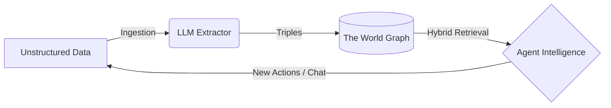

Worlds provides a structured framework for **agent memory**. Instead of
treating an agent's context as a flat list of chat logs or disjointed text
chunks, Worlds organizes information as a **dynamic, queryable model of
reality**.

## The Worlds pipeline

To understand how Worlds powers intelligent agents, you must understand the
lifecycle of data moving through the platform.



### Ingestion

Raw information enters the system from user chats, GitHub repositories, or
PDFs. At this stage, data remains as unstructured human language.

### Neuro-symbolic engine

The Worlds engine uses LLMs to extract meaning and entities. It translates
ambiguous language into structured **triples** (subject → predicate → object).
These facts then merge into a world — an isolated container where the graph
evolves through:

- **Updating** conflicting facts.
- **Extending** existing entities with new context.
- **Inferring** hidden relationships via symbolic reasoning.

### Retrieval

When an agent needs context, it performs a **hybrid search**. This process
mixes semantic vector similarity with deterministic graph traversal to pull a
high-precision slice of reality directly into the context window.

## Storage engine

To achieve both semantic flexibility and structural precision, the storage
engine employs a hybrid strategy.

### Hot RDF memory (n3)

Worlds uses an in-memory, WASM-compiled RDF store that supports SPARQL. The
infrastructure supports any RDF store — including Apache Jena Fuseki or a local
file system — that implements `rdf-patch` forward synchronization.

`n3` is the preferred store because it runs entirely within the JavaScript
runtime, providing isolated, high-performance in-memory state.

- **Pre-loading**: WASM modules are pre-loaded to ensure warm isolates.
- **Hydration**: The SQLite system of record hydrates the graph state upon
  initialization.
- **Edge cache**: Hot state persists in the edge cache between requests for
  millisecond read latency.

### SQLite storage

The system uses a hybrid schema for persistence to avoid the overhead of
general-purpose SPARQL engines on disk while maintaining semantic integrity.

| Table | Purpose |
| :---- | :------ |
| `triples` | Stores atomic units of knowledge (Subject, Predicate, Object) targeting string literals. |
| `chunks` | Stores overlapping text segments with vector embeddings and BM25 ranks. |
| `entity_types` | Optimized mapping of entities to `rdf:type` IRIs for rapid structural filtering. |
| `blobs` | Handles large-scale RDF data and file-based state. |

## Hybrid search and RRF

The platform uses **Reciprocal Rank Fusion (RRF)** to combine results from
distinct indices into a single, unified relevance ranking.

<CardGroup cols={3}>
  <Card title="Semantic search" icon="wand-magic-sparkles">
    Captures conceptual meaning using a vector index with 1536-dimensional
    embeddings.
  </Card>
  <Card title="Keyword search (FTS5)" icon="magnifying-glass">
    Provides exact term matching using the BM25 ranking algorithm via SQLite's
    native full-text search.
  </Card>
  <Card title="Graph context" icon="diagram-project">
    Restricts results based on structural RDF relationships using subject or
    predicate filters.
  </Card>
</CardGroup>

The fusion algorithm follows the industry-standard RRF formula:

$$score = \sum_{d \in D} \frac{1}{60 + rank(d)}$$

### Using hybrid search

```typescript
// Combine vector similarity with graph-based type filtering
const results = await sdk.worlds.search(
  "my-world",
  "cozy places in New York",
  {
    limit: 20,
    types: ["https://schema.org/LocalBusiness"],
    predicates: ["https://schema.org/location"],
  },
);
```

This query finds entities located in New York via the graph that are "cozy"
via vector or FTS search — combining both retrieval strategies in a single
request.

## SPARQL support

Worlds supports the full SPARQL 1.1 specification via the Comunica query engine.

<Tabs>
  <Tab title="SELECT query">
    ```typescript
    const results = await sdk.worlds.sparql(
      "my-world",
      `
        PREFIX schema: <https://schema.org/>
        SELECT ?name ?email WHERE {
          ?person a schema:Person ;
            schema:name ?name .
          OPTIONAL { ?person schema:email ?email . }
        }
        ORDER BY ?name
      `,
    );
    ```
  </Tab>
  <Tab title="INSERT update">
    ```typescript
    await sdk.worlds.sparql(
      "my-world",
      `
        PREFIX ex: <https://example.org/>
        PREFIX schema: <https://schema.org/>
        INSERT DATA {
          ex:alice schema:knows ex:bob .
        }
      `,
    );
    ```
  </Tab>
  <Tab title="DELETE update">
    ```typescript
    await sdk.worlds.sparql(
      "my-world",
      `
        PREFIX ex: <https://example.org/>
        PREFIX schema: <https://schema.org/>
        DELETE DATA {
          ex:alice schema:knows ex:bob .
        }
      `,
    );
    ```
  </Tab>
  <Tab title="Named graphs">
    ```typescript
    const results = await sdk.worlds.sparql(
      "my-world",
      `SELECT ?s ?p ?o WHERE { ?s ?p ?o . }`,
      {
        defaultGraphUris: ["https://example.org/graph1"],
        namedGraphUris: ["https://example.org/graph2"],
      },
    );
    ```
  </Tab>
</Tabs>

## Technical specifications

For the mathematical and philosophical foundations of the Worlds storage
engine, refer to the [Whitepaper](/overview/whitepaper).
