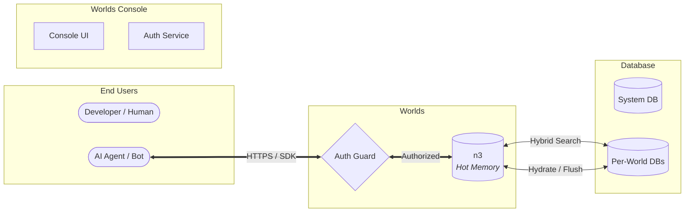

## Abstract

Large Language Models (LLMs) demonstrate remarkable capabilities in natural
language understanding, but they have a fundamental limitation: capability is
not equivalent to knowledge.
[Retrieval-augmented generation](https://en.wikipedia.org/wiki/Retrieval-augmented_generation)
(RAG) using vector databases attempts to bridge this gap, but it often fails to
capture the intricate structural relationships required for complex reasoning
and traceability.

Worlds is a managed infrastructure layer — a "world engine" — that acts as a
detachable hippocampus for AI agents. By combining a
[SPARQL](https://en.wikipedia.org/wiki/SPARQL)-compatible
[RDF](https://en.wikipedia.org/wiki/Resource_Description_Framework) store with
edge-distributed [SQLite](https://en.wikipedia.org/wiki/SQLite) for persistence,
Worlds enables automatic memory (or _auto-memory_) for agents to maintain
mutable, structured knowledge graphs. This system fuses vector search for
semantic intuition with deterministic facts for precise data retrieval,
empowering agents to navigate a persistent, interoperable map of reality rather
than predicting the next token.

Worlds provides the structural scaffolding to guarantee reliable, auditable,
and explainable results even within probabilistic agentic workflows. This
infrastructure serves as the backbone of the "small web," enabling data
ownership and high-precision knowledge retrieval.

## Introduction

### LLM ephemeral nature

Transformer-based models provide agents with fluent communication skills and
broad world knowledge frozen in their weights. However, these models are
stateless. Once a context window closes, the thought is lost. For an AI agent
to operate autonomously over long periods, it requires persistent memory that
is both accessible and mutable.

### The reasoning gap

Current industry standards rely heavily on vector databases to provide
long-term memory. As identified in benchmarks like ARC-AGI-3, true intelligence
requires a system to adapt efficiently to novel, untrained environments. The
reasoning gap occurs because vector search struggles with:

- **Logical precision**: It cannot reliably answer structured queries like
  "Who is the brother of the person who invented X?".
- **Traceability**: In high-stakes fields like medicine or law, agents must
  provide a perfect trace of their reasoning. Vector similarity is a black box;
  it lacks a verifiable audit trail.
- **Temporal awareness**: Standard RAG is stateless and fails to capture
  relationship dynamics or state invalidations over extended horizons.
- **Data silos**: Information remains trapped in proprietary walled gardens,
  hindering the interoperability required for truly autonomous AI entities.

### Solution

Worlds provides malleable knowledge within an AI agent's reach. Unlike static
knowledge bases, Worlds are dynamic, graph-based environments that agents can
query, update, and reason over in real-time.

It acts as a "digital garden" for the next generation of software — a private
world where an assistant knows your relationships, history, and preferences
with 100% accuracy, acting as an extension of your own mind.

### Cognitive architecture

The Worlds Platform mirrors human cognitive systems to provide a structured
"memory stack" for autonomous agents, implementing what is increasingly
recognized as auto-memory — a system that self-organizes and recalls context
without manual engineering.

| Memory type    | Agent perspective       | Worlds Platform implementation                                        |
| :------------- | :---------------------- | :-------------------------------------------------------------------- |
| **Semantic**   | What it **knows**       | **RDF Store**: Structured facts and SPARQL reasoning.                 |
| **Episodic**   | What it **did**         | **Append-only Log**: Temporal history of events and metadata.         |
| **Working**    | What it is **thinking** | **Scratchpad**: Live distillation of knowledge into prompts.          |
| **Procedural** | What it **can do**      | **Tools**: Automated skills for graph operations, tools, and agents.  |
| **Sensory**    | What it **perceives**   | **Ingestion**: Raw data streams and vector indexing.                  |

## Methods

The Worlds Platform utilizes a
[dual-process](https://en.wikipedia.org/wiki/Dual_process_theory)
[neuro-symbolic](https://en.wikipedia.org/wiki/Neuro-symbolic_AI) methodology
to bridge the semantic intuition of neural networks with the deterministic
logic of symbolic systems.

### 1. Neuro-symbolic pipeline

Data ingestion follows a multi-stage transformation process:

1. **Segmentation**: Unstructured text is decomposed into semantically coherent
   chunks optimized for vector retrieval.
2. **Triple extraction**: An LLM-based extraction layer identifies entities and
   predicates, converting narrative flow into formalized RDF triples.
3. **Relational mapping**: Extracted triples are mapped to an established
   ontology, ensuring structural consistency across the global graph.
4. **Semantic indexing**: Each chunk and triple is indexed simultaneously via
   high-dimensional vector embeddings and full-text search (FTS) keys.

### 2. State management

Unlike stateless RAG systems, Worlds treats memory as a dynamic, mutable state.
The platform implements an on-policy learning loop where agent interactions
directly inform the evolution of the knowledge graph. This is achieved through
`rdf-patch` operations that allow for atomic updates, deletions, and forks of
specific knowledge sub-graphs without re-indexing the entire dataset.

## Architecture

The system follows a segregated Client-Server architecture designed for edge
deployment. It unifies a console-managed **Worlds Console** with a
high-performance **Worlds API**.



### Components

- **The SDK**: A canonical TypeScript client that handles authentication and
  type-safe API requests. It acts as the bridge between "neural" code (LLMs)
  and "symbolic" data.
- **The Server**: A minimal Deno-based HTTP server handling SPARQL execution
  and graph management.
- **Forward-sync search store**: A proprietary mechanism that replicates RDF
  data patches into optimized search stores, enabling full-text and semantic
  search over structured triples.

## Storage engine

### n3 (hot memory)

The platform uses an in-memory, WASM-compiled RDF store that supports SPARQL.
The infrastructure is designed to support any RDF store — including Apache Jena
Fuseki or a local file system — that implements `rdf-patch` forward
synchronization.

`n3` is the preferred store because it runs entirely within the JavaScript
runtime, providing isolated, high-performance in-memory state.

- **Pre-loading**: WASM modules are pre-loaded to ensure warm isolates.
- **Hydration**: The SQLite system of record hydrates the graph state upon
  initialization.
- **Edge cache**: Hot state persists in the edge cache between requests for
  millisecond read latency.

### Efficient indexing

To ensure O(log N) performance for graph queries and millisecond responses for
semantic search, the engine implements a multi-index strategy:

- **Graph indexing**: Standard B-tree indices on `subject` and `predicate`
  enable rapid pattern matching for search filters.
- **Vector indexing**: Use of `libsql_vector_idx` for 1536-dimensional
  embeddings, enabling semantic similarity search at the edge.
- **FTS5 indexing**: Native SQLite full-text search for fast keyword matching
  and ranking.
- **Entity type indexing**: Composite indexing on the `entity_types` table
  for high-speed class-based filtering.

### Hybrid search implementation

The system uses Reciprocal Rank Fusion (RRF) to combine results from distinct
indices into a single unified relevance ranking.

The fusion algorithm:

$$score = \sum_{d \in D} \frac{1}{60 + rank(d)}$$

Implemented within the SQLite engine:

```sql
WITH vec_matches AS (
  SELECT id AS rowid, row_number() OVER (PARTITION BY NULL) AS rank_number
  FROM vector_top_k('idx_chunks_vector', vector32(?), ?)
  WHERE ? != ''
),
fts_matches AS (
  SELECT rowid, row_number() OVER (ORDER BY rank) AS rank_number
  FROM chunks_fts WHERE ? != '' AND chunks_fts MATCH ? LIMIT ?
), final AS (
  SELECT
    chunks.id,
    (COALESCE(1.0 / (60 + fts_matches.rank_number), 0.0) +
     COALESCE(1.0 / (60 + vec_matches.rank_number), 0.0)) AS combined_rank
  FROM chunks
  LEFT JOIN fts_matches ON fts_matches.rowid = chunks.rowid
  LEFT JOIN vec_matches ON vec_matches.rowid = chunks.rowid
  WHERE (? = '' OR fts_matches.rowid IS NOT NULL OR vec_matches.rowid IS NOT NULL)
  ORDER BY combined_rank DESC LIMIT ?
)
SELECT * FROM final;
```

This approach allows agents to answer complex queries such as: _"Find entities
located in New York via the graph that are 'cozy' via vector or FTS search."_

### Disambiguation

RRF provides a strong initial ranking, but complex knowledge graphs often
contain ambiguous entities or near-identical triples. The platform supports
two downstream refinement strategies:

<AccordionGroup>
  <Accordion title="Reranking">
    Higher-latency cross-encoder models can rerank the top-K results from the
    hybrid search, providing more nuanced semantic alignment before data
    reaches the agent's context.
  </Accordion>
  <Accordion title="Human-in-the-loop (HITL)">
    When the system identifies low-confidence matches or conflicting entities,
    the malleable nature of Worlds allows the UI to present disambiguation
    prompts to the user via a human-in-the-loop workflow.
  </Accordion>
</AccordionGroup>

## SDK and agents

The World Engine is available to AI agents without requiring developers to
write raw SPARQL. The `@wazoo/worlds-ai-sdk` provides drop-in tools for the
Vercel AI SDK and other agent frameworks:

- **`discover-schema`**: Identifies the structure and predicates present in a
  world to guide agent reasoning.
- **`execute-sparql`**: Allows agents to run precise symbolic queries and
  updates.
- **`search-entities`**: Performs semantic and keyword search to find relevant
  knowledge.
- **`generate-iri`**: Creates stable, predictable identifiers for new entities.

## Benchmarks

### MemoryBench (Tsinghua University)

| Metric                 | Traditional RAG | Worlds (Neuro-Symbolic) | Delta  |
| :--------------------- | :-------------- | :---------------------- | :----- |
| **Declarative Recall** | 68.4%           | 89.2%                   | +20.8% |
| **Procedural Memory**  | 42.1%           | 76.5%                   | +34.4% |
| **On-Policy Learning** | Low             | High                    | N/A    |
| **Efficiency (ms)**    | 120ms           | 45ms (Edge)             | −62.5% |

### Journey to SOTA

The pursuit of state-of-the-art performance has required moving away from the
"black box" of pure vector retrieval.

1. **Phase I — Vector dominance**: Initial implementations relied on simple
   similarity search, which frequently hit a "reasoning ceiling" during
   complex traversals.
2. **Phase II — Hybrid fusion**: The introduction of RRF significantly improved
   retrieval accuracy but lacked structural audit trails.
3. **Phase III — Symbolic grounding**: The current Worlds architecture achieves
   SOTA by grounding every neural retrieval in a deterministic RDF structure.
   This symbolic scaffolding ensures that even when vector indices converge on
   multiple similar results, the graph resolves the correct entity through
   logical context.

## Glossary

| Term               | Definition                                                                                  |
| :----------------- | :------------------------------------------------------------------------------------------ |
| **World**          | An isolated Knowledge Graph instance (RDF Dataset), acting as a memory store for an agent. |
| **Statement**      | An atomic unit of fact (Triple: Subject, Predicate, Object).                                |
| **Chunk**          | A text segment derived from a Statement, optimized for hybrid search.                       |
| **RRF**            | Reciprocal Rank Fusion. An algorithm fusing Keyword (FTS) and Vector search rankings.       |
| **RDF**            | Resource Description Framework. The W3C standard for graph data interchange.                |
| **SPARQL**         | The W3C standard query language for RDF graphs.                                             |
| **Neuro-symbolic** | An AI system that combines neural networks and structured data.                             |

## References

1. **ARC Prize Foundation**. (2026). ARC-AGI-3: Measuring Fluid Intelligence in
   Dynamic Environments. https://arcprize.org/arc-agi-3
2. **Anthropic**. (2024). Model Context Protocol (MCP) Specification.
   https://modelcontextprotocol.io
3. **TrustGraph**. (2025). The Context Graph Manifesto: A New Era of Determinism.
   https://trustgraph.ai/manifesto
4. **Willison, S.** (2024). Hybrid full-text search and vector search with SQLite.
   https://simonwillison.net/2024/Oct/4/hybrid-full-text-search-and-vector-search-with-sqlite/
5. **W3C**. (2013). SPARQL 1.1 Query Language. W3C Recommendation.
   https://www.w3.org/TR/sparql11-query/
6. **RDF.js**. (n.d.). N3Store.js Documentation. https://rdf.js.org/N3.js/docs/N3Store.html
7. **Tsinghua University**. (2025). MemoryBench: A Benchmark for Memory and
   Continual Learning in LLM Systems. https://github.com/supermemoryai/memorybench
